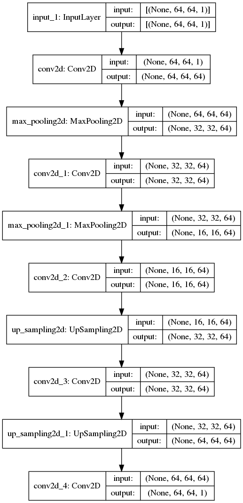
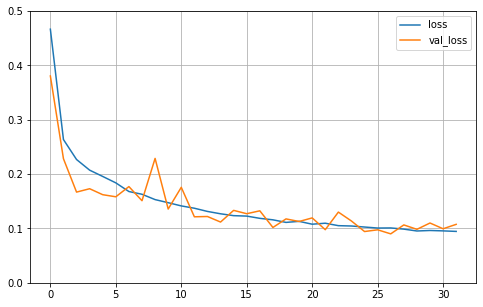

This code is an implementation of the paper - ***Medical image denoising using convolutional denoising autoencoders*** (https://arxiv.org/pdf/1608.04667.pdf).

The model performs satisfactorily well given the small amount of data (less than 300 for training) and a very simple model architecture. This proves the point of the paper that we can use AutoEncoders for denoising even with very less sample of data. The data used for this experiment was - MIAS MiniMammographic Database, (REFERENCE: J Suckling et al (1994) *"The Mammographic Image Analysis Society Digital Mammogram Database"* Exerpta Medica. International Congress Series 1069 pp375-378.), containing 322 images in total. I used 30 images for test and out of 292 remaining, I made a validation split of 10% while training.

The model architecture is as shown-

The model evaluation gives a loss of 0.106, ie Loss = 1-SSIM => SSIM = 1-0.106 = 0.894 which is quite well. From further here, we can improve this work to try using MSE loss, different noises, deeper architectures with skip connections, more data, etc.

